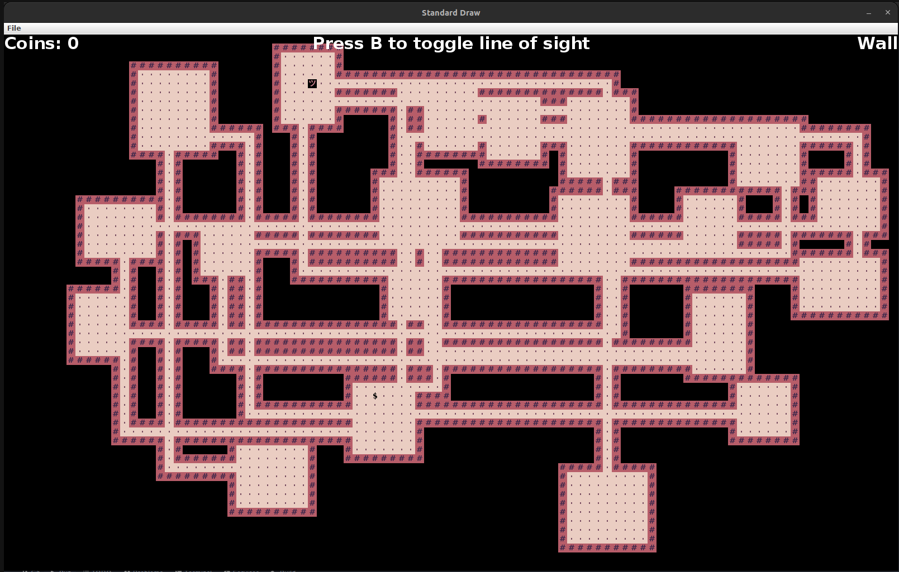

# Build Your Own World Project 
A 2D Minecraft style world generation project using Java. This was the final project for my CS61B class at UC Berkeley. Below is the menu interface. 

The user may choose to alter the theme of the world by using the theme select option. 

After the user selects the "New Game" option, they will be prompted to enter a seed, at which point a world will be generated pseudorandomly based on the seed. When the world is generated, line of sight is enables by default, so the player will be unable to see the full world. 

Pressing "B" will toggle the line of sight and allow the payer to see the full world.

The world will also have a randomly generated coin located at a random location on each turn. The goal is to collect as many of these coins as possible (they will not despawn unless you capture them). Hovering with your mouse over a tile will also display information on the HUD. The HUD also contains the number of coins collected so far. 

Pressing "Q" at any point will quit and save the game. When opening the game again, pressing "L" will load the last saved game. 

# Running the Code
Open up IntelliJ and set the project structure to use the library folder as a java module. This is necessary for the code to run, since there are several "custom packages". Set the Java version to 17.0.4 or higher, and run "Main.java"
